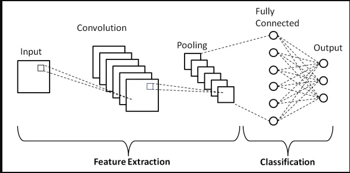
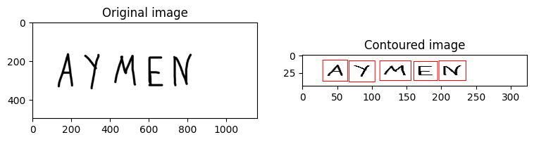
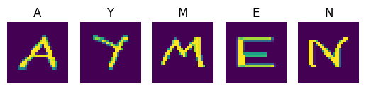

# Handwritten Character Recognition Project

## Overview

This project focuses on recognizing handwritten alphabetic characters using a Convolutional Neural Network (CNN). The dataset used contains 372,450 rows of handwritten character images. The workflow involves building a model for single character recognition and applying it to recognize characters in words extracted from images using OpenCV.

## Dataset

The dataset used contains handwritten characters and can be accessed [here](https://www.kaggle.com/datasets/sachinpatel21/az-handwritten-alphabets-in-csv-format/data).

## Steps

### 1. Loading Necessary Libraries

The project begins by importing essential libraries for image processing, machine learning, and data manipulation:

- **OpenCV** and **PIL** for image processing.
- **TensorFlow** and **Keras** for building and training the neural network.
- **NumPy**, **Pandas**, **Matplotlib**, and **scikit-learn** for data handling and visualization.

### 2. Model Building

#### Single Character Recognition

A Convolutional Neural Network (CNN) model is designed to recognize individual handwritten characters. The CNN architecture includes:

- **Convolutional Layers (`Conv2D`)**: To detect features in the images.
- **Batch Normalization**: To normalize the output of convolutional layers and improve training stability.
- **MaxPooling Layers**: To reduce the spatial dimensions and retain essential features.
- **Flatten Layer**: To convert the 2D feature maps into a 1D vector.
- **Dense Layers**: To perform classification with the final dense layer using softmax activation for multi-class classification.
- **Dropout Layer**: To prevent overfitting by randomly dropping units during training.

### 3. Training the Model

The model is trained with the dataset through the following steps:

- **Data Loading and Preprocessing**: Includes normalization and splitting into training and testing sets.
- **Model Training**: The CNN is trained on the processed data.
- **Evaluation**: The model's performance is evaluated on a separate test set, with metrics such as accuracy and loss reported.

### 4. Handling New Images

#### Contouring the Letters

For recognizing characters in new images:

- **Image Preprocessing**: The image is resized, converted to grayscale, and thresholded.

- **Contour Extraction**: OpenCV's contour functions are used to identify and isolate individual characters.
- **Character Extraction**: Each detected character is extracted, resized to 28x28 pixels, and normalized for prediction.

#### Character Prediction

Each extracted character image is fed into the pre-trained CNN model:

- **Prediction**: The model outputs the predicted character.
- **Visualization**: The results are displayed alongside the processed character images.

### 5. Results

#### Original vs. Processed Image

- **Original Image**: Shows the input image with handwritten text.
- **Processed Image**: Displays the image with contours drawn around each detected character.

**Example Results:**

- **Character Predictions**: Each character extracted from the image is displayed with the model's prediction.
#### Accuracy and Loss

The model's performance metrics, including accuracy and loss, are reported after training. High accuracy indicates that the model effectively recognizes individual characters.

### Conclusion

This project successfully demonstrates a complete pipeline for handwritten text recognition:

- **Single Character Recognition**: Through a CNN model trained on a large dataset.
- **Word Recognition**: By processing and predicting characters from images using OpenCV.

The provided images illustrate the effectiveness of the model in recognizing and extracting characters from new handwritten text images.
